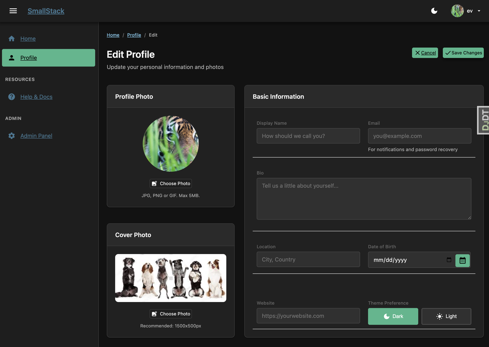

# Django SmallStack

*A minimal Django stack for building and deploying admin-style apps.*


A modern, batteries-included Django starter project built on Django's powerful admin foundation. Production-ready with SQLite, Docker, and zero-downtime Kamal deployment. Clone it, customize it, ship it.


## Features

### Profile App
Complete user profile management with photo uploads, cover images, bio, location, and customizable display names. Extend it with your own fields.



### Help System
Built-in documentation system with markdown support, table of contents, search, and easy-to-edit content files. Perfect for user guides or internal docs.

<p>
  
  
</p>

### Background Tasks
Django 6's new Tasks framework is pre-configured with database backend. Send emails, process data, and run jobs in the background effortlessly.

### Activity Tracking
Lightweight request logging with automatic database pruning. Staff-only dashboard shows site health, response times, user activity, and theme preferences. Configurable row cap (default 10,000), excluded paths for static assets, and htmx live-refresh on detail pages. Zero external dependencies.

### htmx
Progressive enhancement with [htmx](https://htmx.org/) — partial page updates, inline form submissions, and server-driven UI without a build step. Vendored locally (no CDN), CSRF handled automatically. Theme preferences save silently via htmx as the first built-in example.

### Theming
Beautiful light and dark modes with CSS custom properties. Customize colors, shadows, and spacing from a single file. User preferences are saved. Flash-free — an inline head script applies the stored theme before CSS renders.

### Authentication
Custom User model ready for email login. Password reset flows, secure sessions, and extensible auth patterns built on Django's proven foundation.

### Docker Ready
Production-ready Docker configuration with multi-service compose, health checks, and background worker. Deploy anywhere containers run.

### Database Backups
Built-in SQLite backup system with management command, scheduled cron support in Docker, and a staff-only web dashboard. Track backup history, view per-backup detail pages with activity timelines, and configure retention policies. Pruned backups are clearly marked — no false alarms.

### SQLite by Default
Production-ready SQLite configuration with the database stored outside the container. Perfect for solo developers, small teams, and internal applications. No database service fees—just simple, reliable data storage that backs up with your VPS. Upgrade to PostgreSQL when you need it.

## Built on Django Best Practices

- **Split settings** - Separate configurations for development, production, and testing
- **Apps in dedicated folder** - Clean organization with all apps in `apps/` directory
- **Custom User model** - Extensible user model from day one
- **Signals in separate files** - Clean separation of concerns
- **Tests alongside apps** - Tests live with their apps for easy maintenance
- **URL namespacing** - Organized URL patterns (e.g., `help:index`)
- **Organized static files** - Structured CSS and JavaScript
- **Built-in activity tracking** - Request logging dashboard with auto-pruning
- **htmx for progressive enhancement** - Partial updates with no build tools
- **Template structure mirrors apps** - Intuitive template organization
- **SQLite with data separation** - Database stored in `/data/` directory, persists across container rebuilds

## Quick Start

### Prerequisites

- Python 3.12+
- [UV](https://github.com/astral-sh/uv) package manager (recommended)
- Docker Desktop (for containerized deployment)

### Local Development

1. **Clone and enter the project:**
   ```bash
   git clone https://github.com/YOUR_USERNAME/django-smallstack.git
   cd django-smallstack
   ```

2. **Set up environment variables (optional):**
   ```bash
   cp .env.example .env
   # Edit .env to customize — sensible defaults work out of the box
   ```

3. **Run setup:**
   ```bash
   make setup
   ```
   This installs dependencies, runs migrations, creates a dev superuser (`admin`/`admin`), and verifies the configuration.

4. **Start the development server:**
   ```bash
   make run
   ```

5. **Open your browser:**
   - Homepage: http://localhost:8005
   - Admin: http://localhost:8005/admin

### Docker Deployment

1. **Build and run:**
   ```bash
   docker compose up -d
   ```

2. **Access the application:**
   - Homepage: http://localhost:8010

## Project Structure

```
django-smallstack/
├── apps/                      # Django applications
│   ├── accounts/              # Custom user model & auth
│   ├── smallstack/           # Theme helpers (pure presentation)
│   ├── profile/               # User profile management
│   ├── help/                  # Documentation system
│   ├── activity/              # Request tracking & dashboard
│   └── tasks/                 # Background tasks
├── config/                    # Project configuration
│   └── settings/              # Split settings
│       ├── base.py            # Shared settings
│       ├── development.py     # Dev-specific settings
│       ├── production.py      # Production settings
│       └── test.py            # Test settings
├── templates/                 # HTML templates
│   ├── smallstack/           # Base templates, includes & marketing pages
│   │   └── pages/            # SmallStack marketing content
│   ├── website/              # Page wrappers (customize for your project)
│   ├── profile/               # Profile templates
│   ├── help/                  # Help system templates
│   └── registration/          # Auth templates
├── static/                    # Static files
│   ├── smallstack/            # Core theme, brand assets, help assets
│   ├── brand/                 # Project brand overrides
│   ├── css/                   # Project CSS overrides
│   └── js/                    # Project JS
├── docs/                      # Additional documentation
│   └── skills/                # AI assistant skill files
├── docker-compose.yml         # Docker composition
├── Dockerfile                 # Container definition
└── pyproject.toml             # Dependencies & tools config
```

## Documentation

| Location | Audience | Content |
|----------|----------|---------|
| `README.md` | Everyone | Quick start, feature overview, project structure |
| `/help/` (in-app) | End users & developers | Full guides, component reference, deployment docs |
| `docs/skills/` | AI assistants | Structured skill files for Claude Code and similar tools |

## Built to Extend

SmallStack comes pre-populated with working examples and sensible defaults. Use it as-is for internal tools, or customize everything to build your vision.

- **Split settings for dev/prod** - Environment-specific configuration
- **UV package management** - Fast, modern Python packaging
- **Admin theme helpers** - Template tags for breadcrumbs, navigation
- **AI skill files included** - Documentation for AI assistants
- **Starter template page** - Component showcase at `/starter/`
- **Conflict-free customization** - Thin wrapper templates let you replace pages without upstream merge conflicts

## Development

### Running Tests

```bash
uv run pytest              # Tests with coverage summary
make coverage              # Tests + HTML coverage report
open htmlcov/index.html    # Browse per-file coverage
```

108 tests, 69% code coverage across all apps (excluding migrations and test files).

### Code Quality

```bash
# Lint and fix
uv run ruff check --fix .

# Format
uv run ruff format .
```

### Background Worker

For development with background tasks:

```bash
uv run python manage.py db_worker
```

## Documentation

Once running, visit `/help/` for comprehensive documentation including:

- Getting Started guide
- Theming customization
- Docker deployment
- Background tasks
- Activity tracking & monitoring
- Adding new pages

## License

MIT License - Use it, modify it, ship it.
